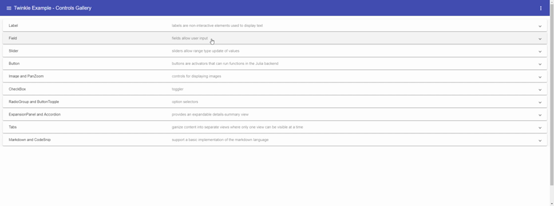

# Glimmer.jl

<table>
<thead>
  <tr>
    <th>Documentation</th>
  </tr>
</thead>
<tbody>
  <tr>
    <td>
      <a href="https://galran.github.io/Glimmer.jl/dev/">
        
      </a>
    </td>
  </tr>
</tbody>
</table>

Glimmer.jl is a [Julia](https://julialang.org/) package for creating fast and simple user interface (UI) using the [Blink](https://github.com/JuliaGizmos/Blink.jl) package. The UI is a dynamic [Angular](https://angular.io/) application that runs inside a Blink window.

It is designed to allow any Julia user to easily create simple UIs, perform quick code experiments where you can tweak the inputs, and visualize the results in the same window. You can update variable values using the interactive controls or using Julia assinments in the REPL or scripts, and Glimmer will make sure everything is synchronized.

__NOTE: I'm currently learning the "art" of Github Actions so expect some rocky road for a few weeks.__


# Basic usage:

```julia
julia> using Glimmer

julia> Glimmer.runExample("Controls")
```



